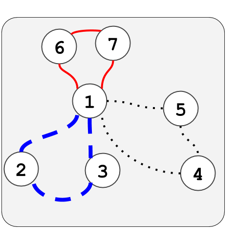

## Three Circuits

时间限制：2s / 空间限制：1024MB

#### 【题目描述】

给出一张简单连通无向图，包含 $N$ 个点和 $M$ 条边。点的编号为 $1$ 至 $N$，边的编号为 $1$ 至 $M$。

第 $i$ 条边双向连接了点 $u_i$ 和点 $v_i$。

判断是否能找出三条回路使得每条边被使用恰好一次。

回路是一条首尾相接的路径，允许重复经过相同的点但不允许重复经过相同的边。

#### 【数据范围与约束】

* 输入中的所有数均为整数。
* $1\le N,M \le 10^5$
* $1\le a_i,b_i\le N$
* 给出的图是简单连通图。

#### 【输入格式】

输入以下方的格式给出：

> $N$ $M$
>
> $a_1$ $b_1$
>
> $\vdots$
>
> $a_M$ $b_M$

####【输出格式】

如果能找出三条回路使得每条边被使用恰好一次，输出 “`Yes`”，否则输出 “`No`”。

#### 【样例输入 1】

```
7 9
1 2
1 3
2 3
1 4
1 5
4 5
1 6
1 7
6 7
```

#### 【样例输入 1】

```
Yes
```

能找出三条回路使得每条边被使用恰好一次，如下图：



#### 【样例输入 2】

```
3 3
1 2
2 3
3 1
```

#### 【样例输出 2】

```
No
```

需要三条回路。

#### 【样例输入 3】

```
18 27
17 7
12 15
18 17
13 18
13 6
5 7
7 1
14 5
15 11
7 6
1 9
5 4
18 16
4 6
7 2
7 11
6 3
12 14
5 2
10 5
7 8
10 15
3 15
9 8
7 15
5 16
18 15
```

#### 【样例输出 3】

```
Yes
```